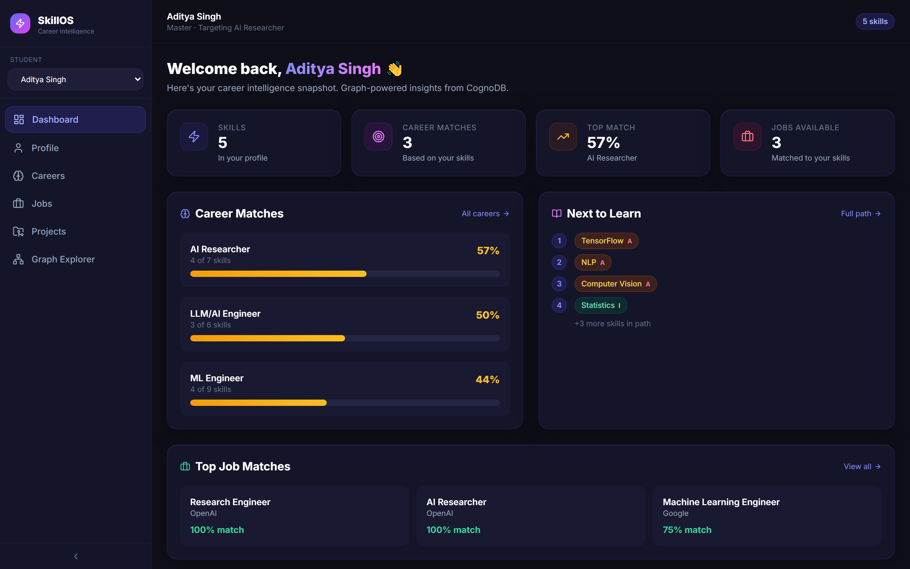
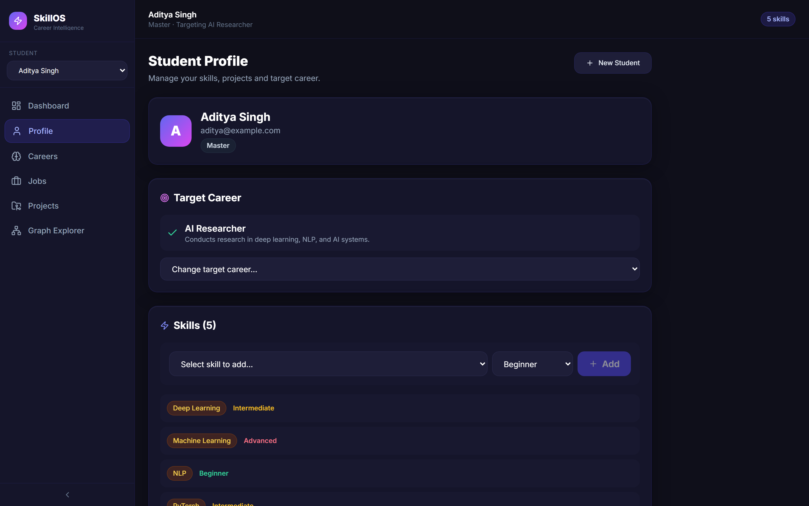
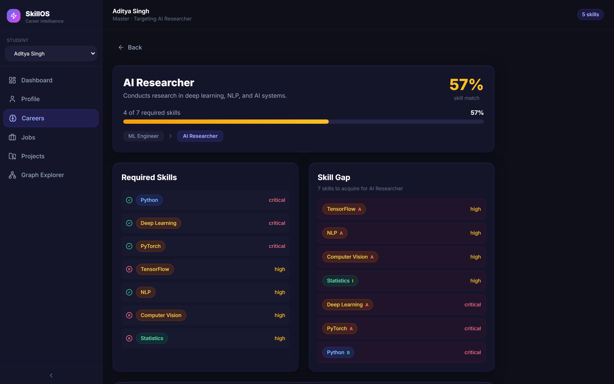
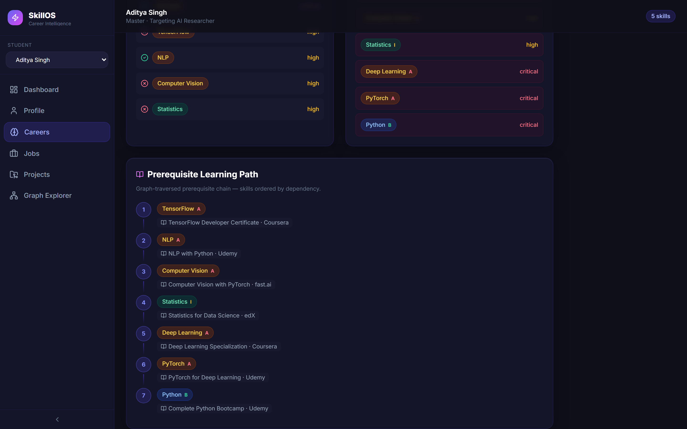
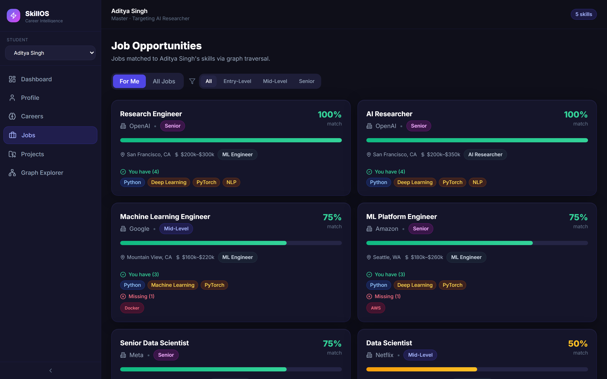
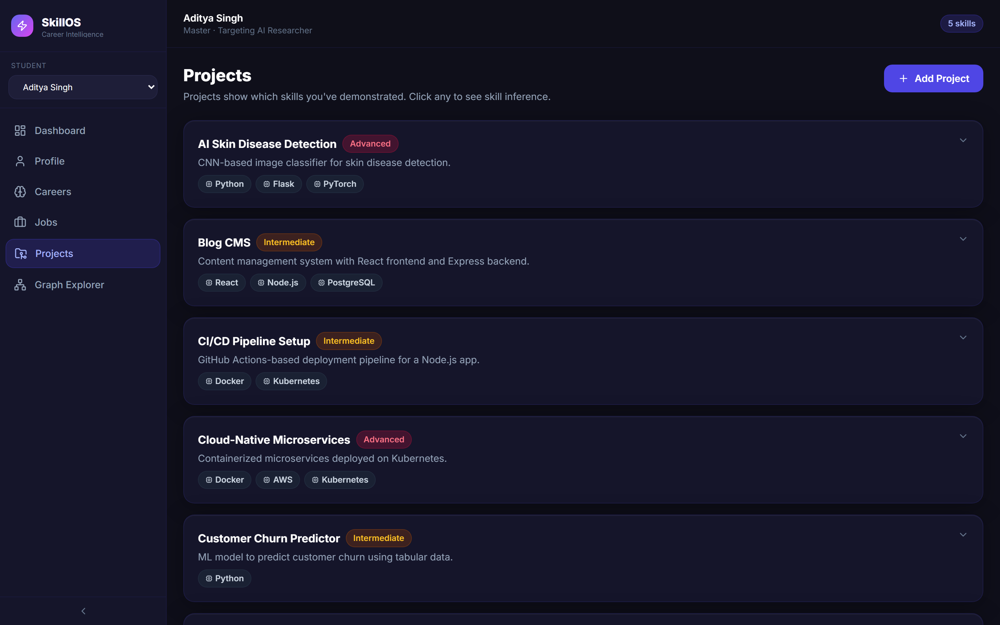
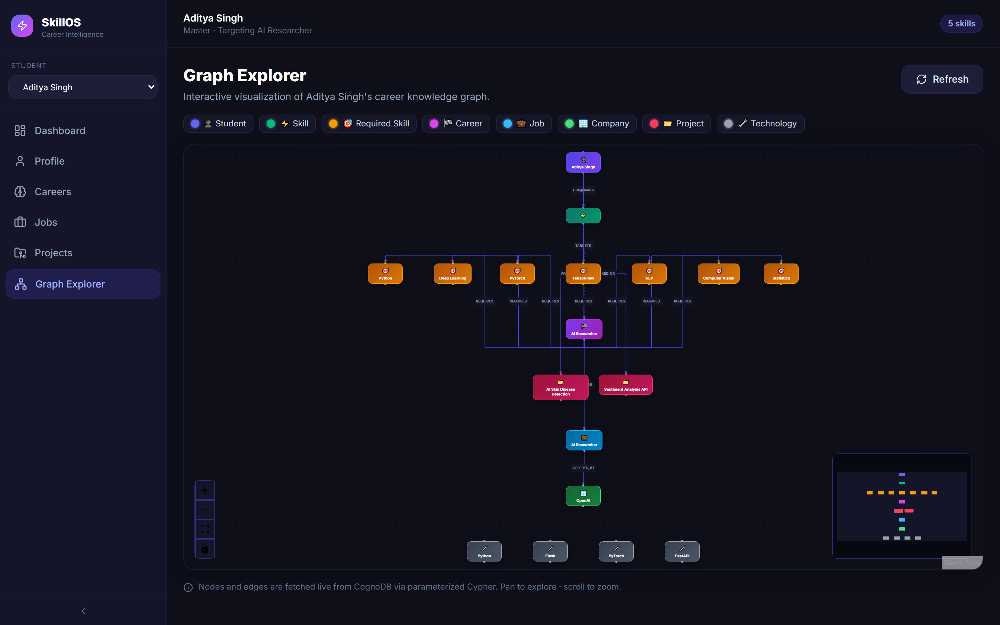

# SkillOS — Student Skill & Career Intelligence Graph

[](https://github.com/Ravikiran9988/SkillOS/actions/workflows/ci.yml)
[](https://nodejs.org/)
[](https://react.dev/)
[-4338CA?logo=neo4j&logoColor=white)](https://cognodb.com/)
[](https://playwright.dev/)

> SkillOS is a full-stack student career intelligence platform powered by **CognoDB**. It connects students, skills, projects, technologies, career roles, courses, jobs, and companies as a graph to identify skill gaps, generate prerequisite learning paths, recommend jobs, and visualize career relationships.

---

## 🌐 Live Production Deployments

- **Live Application (Frontend)**: [https://skill-os-vert.vercel.app/](https://skill-os-vert.vercel.app/)
- **Production API (Backend)**: [https://skillos-api.onrender.com/api](https://skillos-api.onrender.com/api)
- **API Health Check**: [https://skillos-api.onrender.com/api/health](https://skillos-api.onrender.com/api/health)

---

## 📑 Table of Contents

1. [Assignment Focus](#-assignment-focus)
2. [Core User Journey](#-core-user-journey)
3. [Architecture & Deployment Topology](#-architecture--deployment-topology)
4. [Graph Data Model & Schema](#-graph-data-model--schema)
5. [Key Graph Queries (openCypher)](#-key-graph-queries-opencypher)
6. [Feature Matrix](#-feature-matrix)
7. [Screenshots](#-screenshots)
8. [Technology Stack](#-technology-stack)
9. [Project Structure](#-project-structure)
10. [Local Setup & Configuration](#-local-setup--configuration)
11. [Running Locally](#-running-locally)
12. [Automated Testing & Verification](#-automated-testing--verification)
13. [CI/CD Pipeline](#-cicd-pipeline)
14. [Evaluation & Verification Matrix](#-evaluation--verification-matrix)
15. [Demo & Submission Walkthrough](#-demo--submission-walkthrough)
16. [Security & Cypher Safety](#-security--cypher-safety)

---

## 🎯 Assignment Focus

SkillOS models career guidance as a connected knowledge graph rather than flat relational tables. In career navigation, the core domain questions are inherently graph-native:

- **Multi-Hop Career Matching (2-Hop)**: Matching a student to careers based on shared skills (`Person → Skill ← CareerRole`).
- **Variable-Length Prerequisite Traversal (DAG)**: Computing the full dependency chain required to learn an advanced skill (`Skill → PREREQUISITE_OF* → Skill`).
- **Career Path Progression**: Discovering advancement routes between roles (`CareerRole → LEADS_TO* → CareerRole`).
- **Job Matching with Companies (3-Hop)**: Connecting students to openings via required skills and company entities (`Person → Skill ← Job → Company`).
- **Project Skill Inference**: Inferring unlisted skills demonstrated through shared technology stacks (`Project → Technology ← Project → Skill`).
- **Interactive Knowledge Visualization**: Rendering the student's personal graph ecosystem in real-time.

### Why Relational SQL is Awkward for this Domain

| Capability | Relational SQL (RDBMS) | Graph Database (CognoDB / openCypher) |
|---|---|---|
| **Prerequisite Chains** | Requires complex recursive Common Table Expressions (CTEs) with loop counters and cycle guards. | Single declarative variable-length path traversal: `(root:Skill)-[:PREREQUISITE_OF*]->(target)`. |
| **Multi-Hop Traversal** | Explosive join tables (`student_skills`, `career_skills`, `job_skills`, `project_technologies`). | Natural index-free adjacency traversals: `(p:Person)-[:HAS_SKILL]->(s)<-[:REQUIRES]-(cr)`. |
| **Skill Gap Computation** | Complex subqueries, outer joins, and temporary tables. | Set operations in Cypher with collection comprehensions and pattern matching. |
| **Career Progression** | Self-referential foreign keys requiring recursive SQL joins. | Native graph traversal along `[:LEADS_TO*1..3]` paths. |
| **Graph Visualizer Payload** | Multiple relational queries stitched together imperatively in application memory. | Direct node and edge projection returned directly in graph query format. |

---

## 🧭 Core User Journey

```
Student Profile
      ↓
Skills & Proficiencies
      ↓
Target Career Goal
      ↓
Skill Gap Analysis (Match % & Missing Skills)
      ↓
Prerequisite Dependency Ordering
      ↓
Prerequisite Learning Path (with Course Recommendations)
      ↓
Job Opportunities (3-Hop Traversal with Companies)
      ↓
Project Skill Inference (Query H via Tech Stack)
      ↓
Interactive Graph Explorer (React Flow Node-Link Visualization)
```

---

## 🏗️ Architecture & Deployment Topology

```
┌────────────────────────────────────────────────────────┐
│              Frontend Host (Vercel Edge)               │
│         https://skill-os-vert.vercel.app/              │
│   (React 18 · Vite · Tailwind · React Flow · SPA Rewrite)│
└───────────────────────────┬────────────────────────────┘
                            │ HTTPS / REST (VITE_API_URL)
┌───────────────────────────▼────────────────────────────┐
│              Backend Host (Render Cloud)               │
│       https://skillos-api.onrender.com/api             │
│        (Node.js 20 · Express · CORS Whitelist)         │
└───────────────────────────┬────────────────────────────┘
                            │
┌───────────────────────────▼────────────────────────────┐
│                     Service Layer                      │
│ (Career · Student · Job · Project · Learning · Graph)  │
└───────────────────────────┬────────────────────────────┘
                            │
┌───────────────────────────▼────────────────────────────┐
│                   Repository Layer                     │
│  (Parameterized Cypher Query Builders & Session Mgmt)  │
└───────────────────────────┬────────────────────────────┘
                            │ Encrypted Bolt (bolt+s://)
┌───────────────────────────▼────────────────────────────┐
│             CognoDB Cloud Graph Database               │
│               (openCypher Graph Engine)                │
└────────────────────────────────────────────────────────┘
```

### Production Deployment Environment Variables

#### Vercel Frontend Configuration
| Variable | Value | Purpose |
|---|---|---|
| `VITE_API_URL` | `https://skillos-api.onrender.com/api` | Target backend REST API endpoint |

#### Render Backend Configuration
| Variable | Value | Purpose |
|---|---|---|
| `COGNODB_URI` | `bolt+s://db-xxxxxxxx.databases.cognodb.cloud` | Encrypted Bolt connection endpoint |
| `COGNODB_USERNAME` | `cognodb` | CognoDB username |
| `COGNODB_PASSWORD` | `[encrypted password]` | CognoDB database password |
| `CLIENT_ORIGIN` | `https://skill-os-vert.vercel.app` | CORS allowed origin header |
| `NODE_ENV` | `production` | Production runtime optimizations |
| `PORT` | `10000` (set by Render) | Express listening port bound to `0.0.0.0` |

---

## 📐 Graph Data Model & Schema

```
Person (Students)
 ├─[:HAS_SKILL {proficiency}]──────> Skill <──────[:TEACHES]────── Course
 │                                      │
 │                               [:PREREQUISITE_OF]
 │                                      ↓
 │                                   Skill ... (DAG)
 │
 ├─[:WORKED_ON]────────────────────> Project
 │                                      ├─[:USES_TECHNOLOGY]──> Technology
 │                                      └─[:DEMONSTRATES]─────> Skill
 │
 └─[:TARGETS]──────────────────────> CareerRole
                                        ├─[:REQUIRES {importance}]─> Skill
                                        ├─[:LEADS_TO]──────────────> CareerRole
                                        │
                                     Job ──[:FOR_ROLE]───────────> CareerRole
                                        ├────[:OFFERED_BY]─────────> Company
                                        └────[:REQUIRES]───────────> Skill
```

### Seeded Node & Relationship Counts (Verified Idempotent)

| Entity Label | Seeded Count | Key Properties |
|---|---|---|
| **`Person`** | 20 | `id`, `name`, `email`, `educationLevel` |
| **`Skill`** | 50 | `id`, `name`, `category`, `difficulty` |
| **`Technology`** | 20 | `id`, `name`, `category` |
| **`Project`** | 20 | `id`, `name`, `description`, `difficulty` |
| **`CareerRole`** | 15 | `id`, `title`, `description` |
| **`Job`** | 30 | `id`, `title`, `experienceLevel`, `location`, `salaryRange` |
| **`Company`** | 10 | `id`, `name`, `industry` |
| **`Course`** | 30 | `id`, `title`, `platform`, `difficulty`, `duration` |
| **Total Dataset** | **205 Nodes · 370 Relationships** | Verified via `testIdempotency.js` |

---

## ⚡ Key Graph Queries (openCypher)

| Query ID | Name | Traversal Pattern | Domain Purpose |
|---|---|---|---|
| **Query A** | Student Skills | `(Person)-[HAS_SKILL]->(Skill)` | Fetch verified skills and proficiency levels. |
| **Query B** | Career Role Matching | `(Person)-[HAS_SKILL]->(Skill)<-[REQUIRES]-(CareerRole)` | **2-Hop Traversal**: Computes skill match % across all careers. |
| **Query C** | Skill Gap Analysis | `(Person)-[HAS_SKILL]->(Skill)<-[REQUIRES]-(CareerRole)` | Computes matched vs missing skills weighted by importance. |
| **Query D** | Career Progression | `(CareerRole)-[LEADS_TO*1..3]->(CareerRole)` | Traverses career progression routes and seniority pathways. |
| **Query E** | Job Recommendations | `(Person)-[HAS_SKILL]->(Skill)<-[REQUIRES]-(Job)-[OFFERED_BY]->(Company)` | **3-Hop Traversal**: Matches open positions with hiring companies. |
| **Query F & G** | Prerequisite Learning Path | `(Skill)-[PREREQUISITE_OF*]->(Skill)` | **Variable-Length Traversal**: Generates topologically ordered learning paths. |
| **Query H** | Project Skill Inference | `(Project)-[USES_TECH]->(Tech)<-[USES_TECH]-(Project)-[DEMONSTRATES]->(Skill)` | Infers demonstrated skills from shared technology stacks. |

### Implemented Query Examples

#### Query B: 2-Hop Career Matching
```cypher
MATCH (p:Person {id: $personId})-[:HAS_SKILL]->(s:Skill)
WITH collect(s.id) AS studentSkillIds
MATCH (cr:CareerRole)-[:REQUIRES]->(rs:Skill)
WITH cr, collect(rs.id) AS requiredSkillIds, studentSkillIds
WITH cr, requiredSkillIds,
     [id IN requiredSkillIds WHERE id IN studentSkillIds] AS matchedSkillIds
RETURN cr,
       size(matchedSkillIds) AS matchedCount,
       size(requiredSkillIds) AS totalRequired,
       toFloat(size(matchedSkillIds)) / toFloat(size(requiredSkillIds)) * 100.0 AS matchPct
ORDER BY matchPct DESC
```

#### Query E: 3-Hop Job Recommendation Traversal
```cypher
MATCH (p:Person {id: $personId})-[:HAS_SKILL]->(s:Skill)
WITH collect(s.id) AS studentSkillIds
MATCH (j:Job)-[:REQUIRES]->(js:Skill)
MATCH (j)-[:OFFERED_BY]->(c:Company)
WITH j, c, collect(js.id) AS jobSkillIds, studentSkillIds
WITH j, c, jobSkillIds,
     [id IN jobSkillIds WHERE id IN studentSkillIds] AS matched
WHERE size(matched) > 0
RETURN j, c,
       size(matched) AS matchedCount,
       size(jobSkillIds) AS totalRequired,
       toFloat(size(matched)) / toFloat(size(jobSkillIds)) * 100.0 AS matchPercentage
ORDER BY matchPercentage DESC
```

#### Query F & G: Variable-Length Prerequisite DAG Traversal
```cypher
MATCH path = (root:Skill)-[:PREREQUISITE_OF*]->(target:Skill {id: $skillId})
WHERE NOT EXISTS { MATCH (x:Skill)-[:PREREQUISITE_OF]->(root) }
RETURN [node IN nodes(path) | node.name] AS prerequisiteChain,
       length(path) AS depth
ORDER BY depth DESC LIMIT 1
```

#### Query H: Technology-Based Project Skill Inference
```cypher
MATCH (proj:Project {id: $projectId})-[:USES_TECHNOLOGY]->(t:Technology)
OPTIONAL MATCH (proj)-[:DEMONSTRATES]->(directSkill:Skill)
OPTIONAL MATCH (otherProj:Project)-[:USES_TECHNOLOGY]->(t)
MATCH (otherProj)-[:DEMONSTRATES]->(inferredSkill:Skill)
RETURN collect(DISTINCT directSkill) AS directSkills,
       collect(DISTINCT inferredSkill) AS inferredSkills,
       collect(DISTINCT t) AS technologies
```

---

## 💻 Feature Matrix

| Feature | What It Demonstrates |
|---|---|
| **Dashboard** | Real-time metric cards, top career match, student switcher, and recommended jobs overview. |
| **Profile & Skills** | Displays acquired skills with proficiency badges (`Beginner`, `Intermediate`, `Advanced`), target career goal, and dynamic add-skill form. |
| **Career Matching** | Dynamic 2-hop matching algorithm calculating exact match percentages against 15 career tracks. |
| **Skill Gap Analysis** | Compares student capabilities against role requirements, categorizing skills as Critical, High, or Medium priority. |
| **Prerequisite Learning Path** | Graph-traversed prerequisite chain ordering missing competencies with curated course recommendations. |
| **Job Recommendations** | 3-hop traversal matching student skills against active jobs and tier-1 companies with level filtering. |
| **Project Skill Inference** | Query H inference displaying skills demonstrated directly vs. inferred via shared technology stacks. |
| **Career Progression** | Visualizes career advancement tracks via `[:LEADS_TO]` relationships. |
| **Interactive Graph Explorer** | Canvas powered by **React Flow** visualizing multi-label nodes and typed edges. |
| **Graceful Error & Empty States** | Zero-crash UX handling empty skill profiles (`student-20`), invalid routes, and database disconnects. |

---

## 📸 Screenshots

### Dashboard


### Student Profile


### Career Skill Gap


### Prerequisite Learning Path


### Job Recommendations


### Project Skill Inference


### Graph Explorer


---

## 🛠️ Technology Stack

- **Frontend**: React 18, Vite 5, Tailwind CSS, React Flow 11, Recharts, Lucide Icons, Axios
- **Backend**: Node.js 20, Express 4, `neo4j-driver` (Bolt over TLS), REST API architecture
- **Database**: CognoDB (Cloud openCypher graph database via `bolt+s://`)
- **Testing**: Playwright (Real Chromium browser automation), Node.js test runners
- **CI/CD & Deployment**: GitHub Actions, Vercel Edge Network, Render Cloud Services

---

## 📁 Project Structure

```
SkillOS/
├── .github/
│   └── workflows/
│       └── ci.yml             # GitHub Actions CI pipeline
├── client/
│   ├── src/
│   │   ├── components/        # CareerCard, JobCard, SkillBadge, ErrorState, etc.
│   │   ├── context/           # StudentContext state management
│   │   ├── layouts/           # AppLayout with sidebar navigation
│   │   ├── pages/             # Dashboard, Profile, Career, Jobs, Projects, Graph
│   │   └── services/          # Axios API client (dynamic VITE_API_URL)
│   ├── index.html
│   ├── tailwind.config.js
│   ├── vercel.json            # Vercel SPA rewrites
│   └── vite.config.js
├── server/
│   ├── queries/               # Cypher query files (careers, jobs, learning, skills)
│   ├── scripts/               # Seed script and automated test verification suites
│   └── src/
│       ├── config/            # CognoDB driver connection
│       ├── controllers/       # Express controllers
│       ├── middleware/        # Error handlers, request loggers, CORS whitelist
│       ├── repositories/      # Parameterized Cypher execution layer
│       ├── routes/            # REST API endpoints
│       ├── services/          # Business logic & graph traversal algorithms
│       ├── app.js
│       └── server.js
├── docs/
│   ├── data-model.md          # Comprehensive data model specifications
│   ├── FINAL_ACCEPTANCE_REPORT.md # 11-point Wexa acceptance report
│   └── screenshots/           # 7 Retina screenshots
├── e2e/                       # 10 Playwright browser E2E spec files
├── playwright.config.js       # Playwright test runner config with PLAYWRIGHT_BASE_URL support
├── render.yaml                # Render Blueprint infrastructure-as-code spec
├── vercel.json                # Root Vercel SPA rewrites
├── .env.example               # Environment variables template
├── package.json               # Root scripts
└── README.md
```

---

## ⚙️ Local Setup & Configuration

### Prerequisites
- **Node.js**: 20.x or higher
- **Git**: Installed
- **CognoDB Account**: Active instance URI and credentials

### 1. Clone the Repository
```bash
git clone https://github.com/Ravikiran9988/SkillOS.git
cd SkillOS
```

### 2. Install Dependencies
```bash
# Root & Playwright test runner dependencies
npm install

# Client dependencies
cd client && npm install

# Server dependencies
cd ../server && npm install
cd ..
```

### 3. Configure Environment Variables
Create a `.env` file in the root directory based on `.env.example`:

```bash
cp .env.example .env
```

Set your CognoDB credentials:
```env
COGNODB_URI=bolt+s://db-xxxxxxxx.databases.cognodb.cloud
COGNODB_USERNAME=cognodb
COGNODB_PASSWORD=your_password_here
PORT=3001
VITE_API_URL=http://localhost:3001
```

> [!CAUTION]
> Never commit `.env` or hardcode database passwords. `.env` is included in `.gitignore`.

---

## 🚀 Running Locally

### 1. Seed the Graph Database
Populate CognoDB with the complete, idempotent 205-node dataset:
```bash
npm run seed
```

### 2. Start the Backend API
```bash
npm run server
# Server listening on http://localhost:3001
```

### 3. Start the Frontend Client
In a separate terminal:
```bash
npm run client
# Client running on http://localhost:5173
```

---

## 🧪 Automated Testing & Verification

### Local API & Graph Traversal Test Suites

```bash
cd server

# 1. Complete REST API Test Suite (19 tests)
npm run test:api

# 2. Graph-Native Queries Verification (6 tests)
npm run test:graph

# 3. Edge Cases & Error Handling Suite (11 tests)
npm run test:edge

# 4. Seed Script Idempotency Verification
npm run test:idempotency

# 5. Full End-to-End User Journey Simulation (10 tests)
npm run test:journey
```

### Real Browser Playwright E2E Test Suite

SkillOS includes a real Chromium browser end-to-end test suite testing actual DOM interactions across all routes:

```bash
# Run all 11 real browser E2E tests against local environment
npm run test:e2e

# Run Playwright E2E tests against live production deployment
npm run test:e2e:prod

# Run with interactive Playwright UI mode
npm run test:e2e:ui

# View standalone interactive HTML report
npm run test:e2e:report
```

---

## 🔄 CI/CD Pipeline

SkillOS uses **GitHub Actions** for automated continuous integration.

```
Checkout → Node 20 → npm ci → Build Frontend → Install Playwright → Seed CognoDB → Start Services → 11 Playwright E2E Tests → Upload Artifacts
```

- **Pipeline Triggers**: Every `push` and `pull_request` targeting `main`.
- **Encrypted Secrets**: `COGNODB_URI`, `COGNODB_USERNAME`, and `COGNODB_PASSWORD` are supplied via GitHub Actions repository secrets.
- **Latest Verified CI Run**: [Run #5](https://github.com/Ravikiran9988/SkillOS/actions/runs/21798835848) — **SUCCESS** (11/11 Playwright tests passed in 58s on Ubuntu runner).

---

## 📊 Evaluation & Verification Matrix

| Wexa Assignment Requirement | Implementation Evidence | Status |
|---|---|---|
| **CognoDB Graph Layer** | Connected via official `neo4j-driver` over encrypted Bolt (`bolt+s://`). | **PASS** |
| **Graph-Native Queries** | Implemented 2-hop career matching, 3-hop job matching, variable-length prerequisite DAGs, and technology inference. | **PASS** |
| **Parameterized Cypher** | 100% of Cypher queries use `$params` maps; zero string concatenation. | **PASS** |
| **Realistic Graph Seed Data** | 205 nodes, 370 relationships across 8 labeled entity types. | **PASS** |
| **Seed Idempotency** | Verified re-running `seed.js` produces zero duplicate nodes or edges. | **PASS** |
| **Frontend UI/UX** | React 18 application with React Flow visualizer, dark glassmorphism design. | **PASS** |
| **Real Browser E2E Tests** | 11/11 Playwright Chromium tests passed with real browser automation. | **PASS** |
| **GitHub Actions CI** | Automated CI pipeline with green status on `main`. | **PASS** |
| **Production Build** | Frontend Vite bundle builds cleanly in 5s with zero errors. | **PASS** |
| **Error Handling & Degraded State** | `<ErrorState>` handles 404s, empty profiles, and database disconnects cleanly. | **PASS** |

---

## 🎥 Demo & Submission Walkthrough

- **Live Application**: [https://skill-os-vert.vercel.app/](https://skill-os-vert.vercel.app/)
- **Suggested Evaluation Flow**:
  1. Open the application at `https://skill-os-vert.vercel.app/`.
  2. Select **Aditya Singh** (`student-5`) from the sidebar selector.
  3. View **Dashboard**: Observe calculated top match (AI Researcher at 57%) and job recommendations.
  4. Navigate to **Profile**: Inspect verified skills (`Python`, `PyTorch`, `Deep Learning`) and proficiencies.
  5. Navigate to **Careers** → **AI Researcher**: Inspect required skills vs. missing skill gap.
  6. Scroll down to **Prerequisite Learning Path**: Observe prerequisite-ordered competency chain.
  7. Navigate to **Jobs**: Filter senior positions and review 3-hop matched companies.
  8. Navigate to **Projects**: Expand *AI Skin Disease Detection* to inspect Query H skill inference.
  9. Navigate to **Graph Explorer**: Pan and zoom the live React Flow knowledge graph.
  10. Switch student to **Mohan Das** (`student-20`) to verify clean empty-state handling.

---

## 🔐 Security & Cypher Safety

- **Zero Hardcoded Secrets**: Scanned repository with 0 instances of passwords, API keys, or private URIs.
- **Git-Ignored Credentials**: `.env` and `.env.local` are explicitly ignored by `.gitignore`.
- **Encrypted CI Secrets**: Credentials in GitHub Actions are stored in encrypted repository secrets.
- **Injection-Proof Queries**: 100% parameterized openCypher queries preventing Cypher injection.
- **Artifact Protection**: Generated test reports (`playwright-report/`, `test-results/`) are excluded from version control.

---

## 👥 Author

Built for the **Wexa AI CognoDB Assignment 2** — Student Skill & Career Intelligence Graph.
